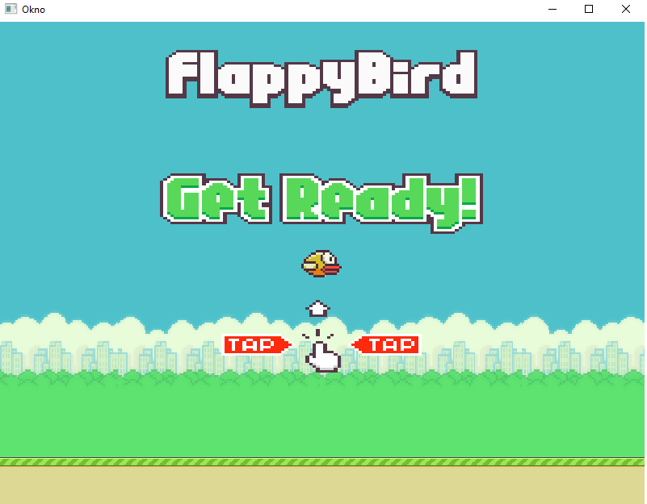
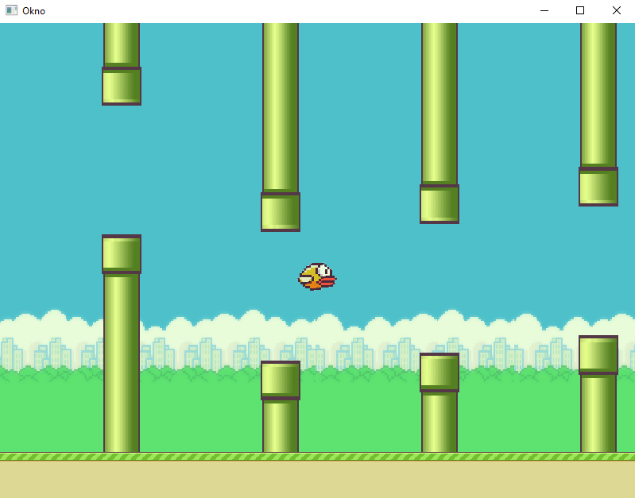

# Description
This repository contains development of graphics engine aimed to serve as an educational project for learning computer graphics. Currently, engine provides: 
rendering system, input polling, events and asset manager. Repo also includes an example app in the form of a simple platform game to present capabilities of 
an engine. Technologies used in the project are C++ and OpenGL.

# Installation
Project was developed on Windows platform. In order to compile this program it is required to have Visual Studio 2017 or 2019.

1. Clone the repo
   ```sh
   https://github.com/Nefretus/GraphicsEngine.git
   ```
2. Open solution file in Visual Studio.
3. Press 'Local Windows Debugger'.

## Sample game screenshots


